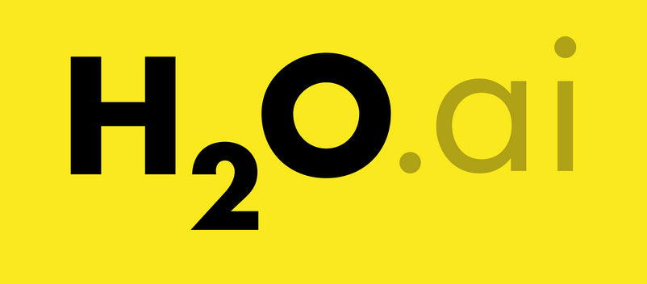

H2O is an in-memory platform for distributed, scalable machine learning. H2O uses familiar interfaces like R, Python, Scala, Java, JSON and the Flow notebook/web interface, and works seamlessly with big data technologies like Hadoop and Spark. H2O provides implementations of many popular algorithms such as GBM, Random Forest, Deep Neural Networks, Word2Vec and Stacked Ensembles. H2O is extensible so that developers can add data transformations and custom algorithms of their choice and access them through all of those clients.

Data collection is easy. Decision making is hard. H2O makes it fast and easy to derive insights from your data through faster and better predictive modeling. H2O allows online scoring and modeling in a single platform.

1. Downloading H2O-3
While most of this README is written for developers who do their own builds, most H2O users just download and use a pre-built version. If you are a Python or R user, the easiest way to install H2O is via PyPI or Anaconda (for Python) or CRAN (for R):

Python
```
pip install h2o
```
R
```
install.packages("h2o")
````

For the latest stable, nightly, Hadoop (or Spark / Sparkling Water) releases, or the stand-alone H2O jar, please visit: https://h2o.ai/download

More info on downloading & installing H2O is available in the [H2O User Guide](http://docs.h2o.ai/h2o/latest-stable/h2o-docs/downloading.html).
